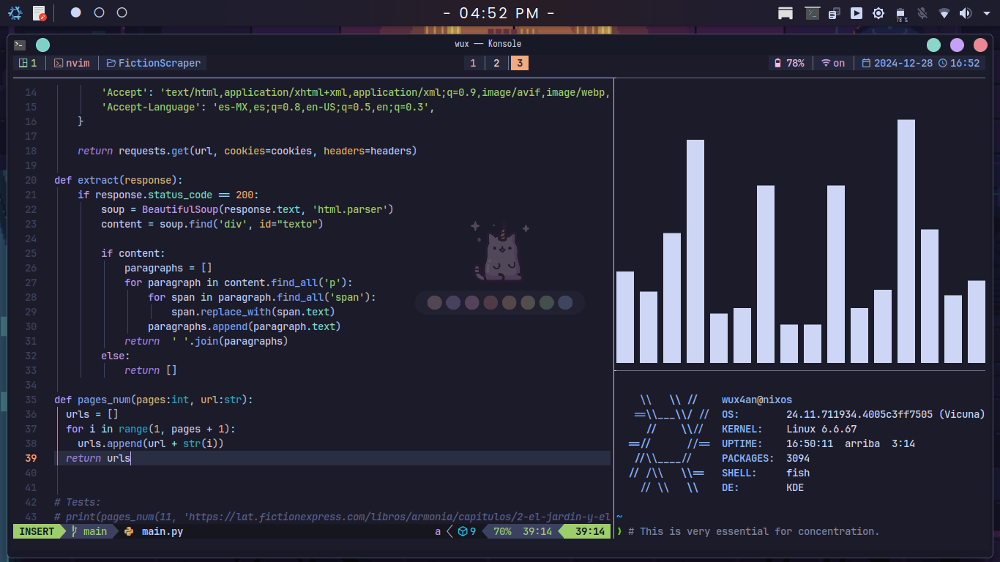
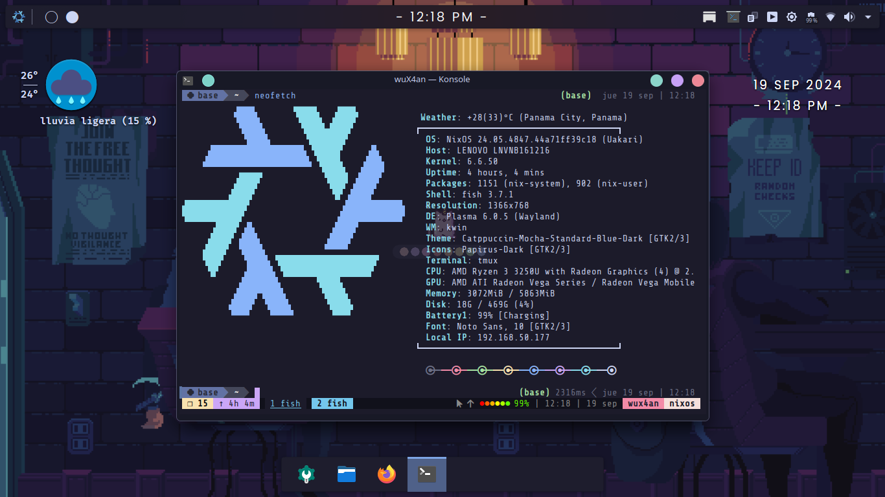
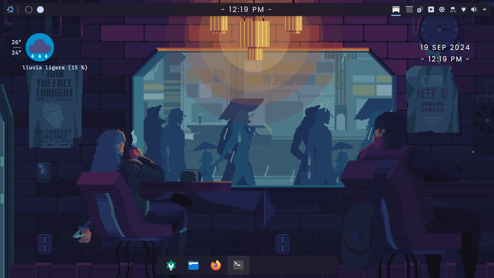

<center><h1>My Nixos Ricing In KDE Plasma</h1></center>

<h2>Workbench:</h2>


<h2>Neofetch:</h2>


<h2>Desktop:</h2>


<br>
<br>

---

* #### Desktop Theme: [Catppuccin Mocha Standart Blue Dark](https://github.com/catppuccin/kde)
* #### Window Decoration: [Scratchy](https://store.kde.org/p/1898344/)
* #### Terminal Theme: [Catppuccin](https://github.com/catppuccin/konsole)
* #### Icons: [Papirus Icon Dark](https://github.com/PapirusDevelopmentTeam/papirus-icon-theme)
* #### Font: [ShureTechMono Nerd Font](https://github.com/ryanoasis/nerd-fonts/releases/download/v3.2.1/ShareTechMono.zip)
* #### Editor: [Helix](https://helix-editor.com/)
* #### Multiplexor: [Tmux](https://github.com/gpakosz/.tmux)
* #### Shell: [Fish](https://fishshell.com/)
* #### Fish Theme: [Bobthefish](https://github.com/oh-my-fish/theme-bobthefish)
* #### Fish Extension Manager: [Oh My Fish](https://github.com/oh-my-fish/oh-my-fish/)
* #### Pyton Env Manager: [Conda](https://anaconda.org/anaconda/conda)

<br>
<br>

<h2>Install</h2>

```fish
echo "Just see, don't touch"
```

<br>
<a href="./config">Here</a>
